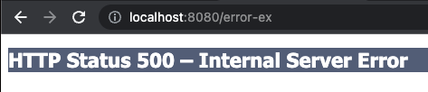
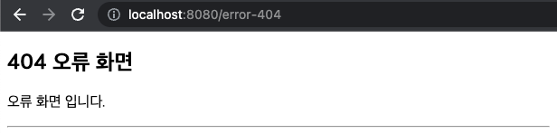
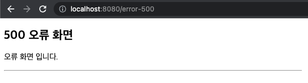
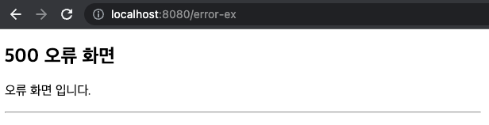

# 예외 처리와 오류 페이지

## 프로젝트 생성

* [스프링 부트 스타터](https://start.spring.io/)
* 프로젝트 선택
    * Project: Gradle Project
    * Language: Java
    * Spring Boot: 3.0.2
* Project Metadata
    * Group: hello
    * Artifact: spring-core-mvc2-8
    * Name: spring-core-mvc2-8
    * Package name: hello.spring-core-mvc2-8
    * Packaging: Jar
    * Java: 17
* Dependencies: Spring Web, Lombok , Thymeleaf, Validation

## 서블릿 예외 처리 - 시작

서블릿은 다음 2가지 방식으로 예외 처리를 지원한다.

* `Exception` (예외)
* `response.sendError(HTTP 상태 코드, 오류 메시지)`

### Exception - 예외

#### 자바 직접 실행

자바의 메인 메서드를 직접 실행하는 경우 `main`이라는 이름의 쓰레드가 실행된다.

실행 도중에 예외를 잡지 못하고 처음 실행한 `main()`메서드를 넘어서 예외가 던져지면,
예외 정보를 남기고 해당 쓰레드는 종료된다.

#### 웹 애플리케이션

웹 애플리케이션은 사용자 요청별로 별도의 쓰레드가 할당되고, 서블릿 컨테이너 안에서 실행된다.

애플리케이션에서 예외가 발생했는데, 어디선가 `try-catch`로 예외를 잡아서 처리하면 아무런 문제가 없다.
그런데 만약에 애플리케이션에서 예외를 잡지 못하고, 서블릿 밖으로까지 예외가 전달되면 어떻게 동작할까?

```
WAS(여기까지 전파) <- 필터 <- 서블릿 <- 인터셉터 <- 컨트롤러(예외발생)
```

결국 톰캣 같은 WAS 까지 예외가 전달된다. `WAS`는 예외가 올라오면 어떻게 처리해야 할까?

#### application.properties

먼저 스프링 부트가 제공하는 기본 예외 페이지가 있는데 이건 꺼두자. (뒤에서 다시 설명하겠다.)

```properties
server.error.whitelabel.enabled=false
```

### ServletExController - 서블릿 예외 컨트롤러

```java
@Slf4j
@Controller
public class ServletExController {
    @GetMapping("/error-ex")
    public void errorEx() {
        throw new RuntimeException("예외 발생!");
    }
}
```

#### 결과 - /error-ex



웹 브라우저에서 개발자 모드로 확인해보면 HTTP 상태 코드가 500으로 보인다.

`Exception`의 경우 서버 내부에서 처리할 수 없는 오류가 발생한 것으로 생각해서 HTTP 상태 코드 500을 반환한다.

#### 결과 - /no-page


톰캣이 기본으로 제공하는 404 오류 화면을 볼 수 있다.

### response.sendError(status, message)

오류가 발생했을 때 `HttpServletResponse`가 제공하는 `sendError`라는 메서드를 사용해도 된다.

이것을 호출한다고 당장 예외가 발생하는 것은 아니지만, 서블릿 컨테이너에게 오류가 발생했다는 점을 전달할 수 있다.

이 메서드를 사용하면 HTTP 상태 코드와 오류 메시지도 추가할 수 있다.

* `response.sendError(HTTP 상태 코드)`
* `response.sendError(HTTP 상태 코드, 오류 메시지)`

### ServletExController - 추가

```java
@Slf4j
@Controller
public class ServletExController {
    @GetMapping("/error-404")
    public void error404(
            HttpServletResponse resp
    ) throws IOException {
        resp.sendError(404, "404 오류!");
    }

    @GetMapping("/error-500")
    public void error500(
            HttpServletResponse resp
    ) throws IOException {
        resp.sendError(500);
    }
}
```

### sendError 흐름

```
WAS(sendError 호출 기록 확인) <- 필터 <- 서블릿 <- 인터셉터 <- 컨트롤러
(response.sendError())
```

`response.sendError()`를 호출하면 `response` 내부에는 오류가 발생했다는 상태를 저장해둔다.

그리고 서블릿 컨테이너는 고객에게 응답 전에 `response`에 `sendError()`가 호출되었는지 확인한다.
그리고 호출되었다면 설정한 오류 코드에 맞추어 기본 오류 페이지를 보여준다.

### 정리

서블릿 컨테이너가 제공하는 기본 예외 처리 화면은 사용자가 보기에 불편하다.
의미 있는 오류 화면을 제공해보자.

## 서블릿 예외 처리 - 오류 화면 제공

서블릿 컨테이너가 제공하는 기본 예외 처리 화면은 고객 친화적이지 않다.
서블릿이 제공하는 오류 화면 기능을 사용해보자.

서블릿은 `Exception`(예외)가 발생해서 서블릿 밖으로 전달되거나
또는 `response.sendError()`가 호출되었을 때 각각의 상황에 맞춘 오류 처리 기능을 제공한다.

이 기능을 사용하면 친절한 오류 처리 화면을 준비해서 고객에게 보여줄 수 있다.

### 서블릿 오류 페이지 등록

```java
@Component
public class WebServerCustomizer
        implements WebServerFactoryCustomizer<ConfigurableWebServerFactory> {
    @Override
    public void customize(
            ConfigurableWebServerFactory factory
    ) {
        ErrorPage errorPage404 = new ErrorPage(HttpStatus.NOT_FOUND, "/error-page/404");
        ErrorPage errorPage500 = new ErrorPage(HttpStatus.INTERNAL_SERVER_ERROR, "/error-page/500");
        ErrorPage errorPageEx = new ErrorPage(RuntimeException.class, "/error-page/500");

        factory.addErrorPages(errorPage404, errorPage500, errorPageEx);
    }
}
```

* `response.sendError(404)`: errorPage404 호출
* `response.sendError(500)`: errorPage500 호출
* `RuntimeException`또는 그 자식 타입의 예외: errorPageEx 호출

500 예외가 서버 내부에서 발생한 오류라는 뜻을 포함하고 있기 때문에 여기서는 예외가 발생한 경우도 500 오류 화면으로 처리했다.

오류 페이지는 예외를 다룰 때 해당 예외와 그 자식 타입의 오류를 함께 처리한다.
예를 들어서 위의 경우 `RuntimeException`은 물론이고 `RuntimeException`의 자식도 함께 처리한다.

오류가 발생했을 때 처리할 수 있는 컨트롤러가 필요하다.
예를 들어서 `RuntimeException`예외가 발생하면 `errorPageEx`에서 지정한 `/error-page/500`이 호출된다.

### ErrorPageController

```java
@Slf4j
@Controller
@RequestMapping("/error-page")
public class ErrorPageController {
    @RequestMapping("/404")
    public String errorPage404(
            HttpServletRequest req,
            HttpServletResponse resp
    ) {
        log.info("GET /error-page/404");
        return "error-page/404";
    }

    @RequestMapping("/500")
    public String errorPage500(
            HttpServletRequest req,
            HttpServletResponse resp
    ) {
        log.info("GET /error-page/500");
        return "error-page/500";
    }
}
```

### View

#### error-page/404.html

```html
<!DOCTYPE HTML>
<html>
<head>
    <meta charset="utf-8">
</head>
<body>
<div class="container" style="max-width: 600px">
    <div class="py-5 text-center">
        <h2>404 오류 화면</h2>
    </div>
    <div>
        <p>오류 화면 입니다.</p>
    </div>
    <hr class="my-4">
</div> <!-- /container -->
</body>
</html>
```

#### error-page/500.html

```html
<!DOCTYPE HTML>
<html>
<head>
    <meta charset="utf-8">
</head>
<body>
<div class="container" style="max-width: 600px">
    <div class="py-5 text-center">
        <h2>500 오류 화면</h2>
    </div>
    <div>
        <p>오류 화면 입니다.</p>
    </div>
    <hr class="my-4">
</div> <!-- /container -->
</body>
</html>
```

### 실행 결과







## 서블릿 예외 처리 - 오류 페이지 작동 원리

서블릿은 `Exception`(예외)가 발생해서 서블릿 밖으로 전달되거나
또는 `response.sendError()`가 호출되었을 때 설정된 오류 페이지를 찾는다.

#### 예외 발생 흐름

```
WAS(여기까지 전파) <- 필터 <- 서블릿 <- 인터셉터 <- 컨트롤러(예외발생)
```

#### sendError 흐름

```
WAS(sendError 호출 기록 확인) <- 필터 <- 서블릿 <- 인터셉터 <- 컨트롤러
(response.sendError())
```

WAS는 해당 예외를 처리하는 오류 페이지 정보를 확인한다.
`new ErrorPage(RuntimeException.class, "/error-page/500")`

예를 들어서 `RuntimeException`예외가 WAS까지 전달되면, WAS는 오류 페이지 정보를 확인한다.
확인해보니 `RuntimeException`의 오류 페이지로 `/error-page/500`이 지정되어 있다.
WAS는 오류 페이지를 출력하기 위해 `/error-page/500`를 **다시 요청**한다.

#### 오류 페이지 요청 흐름

```
WAS `/error-page/500` 다시 요청 -> 필터 -> 서블릿 -> 인터셉터 -> 컨트롤러(/error-page/500) -> View
```

### 예외 발생과 오류 페이지 요청 흐름

```
...
WAS(여기까지 전파) <- 필터 <- 서블릿 <- 인터셉터 <- 컨트롤러(예외발생)
WAS `/error-page/500` 다시 요청 -> 필터 -> 서블릿 -> 인터셉터 -> 컨트롤러(/error-page/500) -> View
...
```

**중요한 점은 웹 브라우저(클라이언트)는 서버 내부에서 이런 일이 일어나는지 전혀 모른다는 점이다.
오직 서버 내부에서 오류 페이지를 찾기 위해 추가적인 호출을 한다.**

정리하면 다음과 같다.

1. 예외가 발생해서 WAS까지 전파된다.
2. WAS는 오류 페이지 경로를 찾아서 내부에서 오류 페이지를 호출한다.
   이때 오류 페이지 경로로 필터, 서블릿, 인터셉터, 컨트롤러가 모두 다시 호출된다.

### 오류 정보 추가

WAS는 오류 페이지를 단순히 다시 요청만 하는 것이 아니라, 오류 정보를 `request`의 `attribute`에 추가해서 넘겨준다.

필요하면 오류 페이지에서 이렇게 전달된 오류 정보를 사용할 수 있다.

### RequestDispatcher

```java
public interface RequestDispatcher {
    // ...
    public static final String ERROR_EXCEPTION = "javax.servlet.error.exception";
    public static final String ERROR_EXCEPTION_TYPE = "jakarta.servlet.error.exception_type";
    public static final String ERROR_MESSAGE = "jakarta.servlet.error.message";
    public static final String ERROR_REQUEST_URI = "jakarta.servlet.error.request_uri";
    public static final String ERROR_SERVLET_NAME = "jakarta.servlet.error.servlet_name";
    public static final String ERROR_STATUS_CODE = "jakarta.servlet.error.status_code";
    // ...
}
```

### ErrorPageController - 오류 출력

```java
@Slf4j
@Controller
@RequestMapping("/error-page")
public class ErrorPageController {
    private void printErrorInfo(
            HttpServletRequest req
    ) {
        // 예외
        log.info("ERROR_EXCEPTION: ex = {}", req.getAttribute(RequestDispatcher.ERROR_EXCEPTION));
        
        // 예외 타입
        log.info("ERROR_EXCEPTION_TYPE: {}", req.getAttribute(RequestDispatcher.ERROR_EXCEPTION_TYPE));
        
        // 예외 메세지
        log.info("ERROR_MESSAGE: {}", req.getAttribute(RequestDispatcher.ERROR_MESSAGE));
        
        // 오류가 발생한 클라이언트 요청 URI
        log.info("ERROR_REQUEST_URI: {}", req.getAttribute(RequestDispatcher.ERROR_REQUEST_URI));
        
        // 오류가 발생한 서블릿 이름
        log.info("ERROR_SERVLET_NAME: {}", req.getAttribute(RequestDispatcher.ERROR_SERVLET_NAME));
        
        // 오류가 발생한 HTTP 상태 코드
        log.info("ERROR_STATUS_CODE: {}", req.getAttribute(RequestDispatcher.ERROR_STATUS_CODE));
        
        // 정상 호출: REQUEST
        // 오류 호출: ERROR
        log.info("dispatchType: {}", req.getDispatcherType());
    }

    @RequestMapping("/404")
    public String errorPage404(
            HttpServletRequest req,
            HttpServletResponse resp
    ) {
        log.info("GET /error-page/404");
        printErrorInfo(req);
        return "error-page/404";
    }

    @RequestMapping("/500")
    public String errorPage500(
            HttpServletRequest req,
            HttpServletResponse resp
    ) {
        log.info("GET /error-page/500");
        printErrorInfo(req);
        return "error-page/500";
    }
}
```

#### `request.attribute`에 서버가 담아준 정보

* `javax.servlet.error.exception` : 예외
* `javax.servlet.error.exception_type` : 예외 타입
* `javax.servlet.error.message` : 오류 메시지
* `javax.servlet.error.request_uri` : 클라이언트 요청 URI
* `javax.servlet.error.servlet_name` : 오류가 발생한 서블릿 이름
* `javax.servlet.error.status_code` : HTTP 상태 코드

## 서블릿 예외 처리 - 필터

## 서블릿 예외 처피 - 인터셉터

## 스프링 부트 - 오류 페이지 1

## 스프링 부트 - 오류 페이지 2

## 정리
