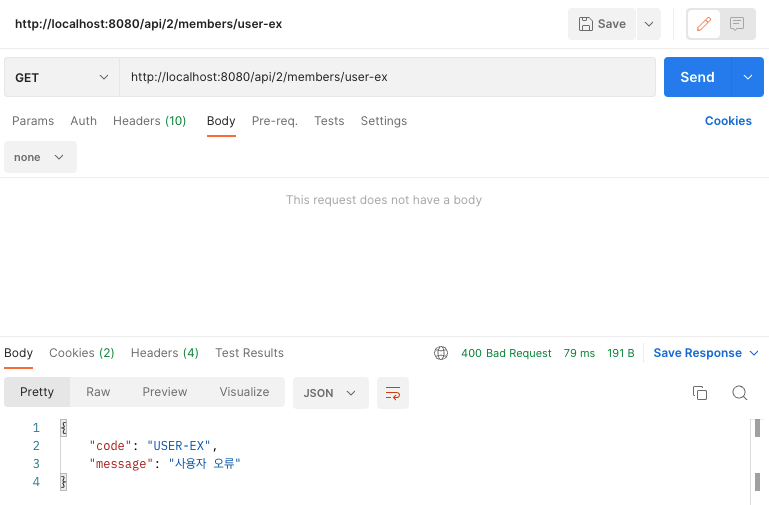

# API 예외 처리

## 시작

### 목표

API 예외 처리는 어떻게 해야할까?

HTML 페이지의 경우 지금까지 설명했던 것 처럼 4xx, 5xx와 같은 오류 페이지만 있으면 대부분의 문제를 해결할 수 있다.

그런데 API의 경우에는 생각할 내용이 더 많다.
오류 페이지는 단순히 고객에게 오류 화면을 보여주고 끝이지만,
API는 각 오류 상황에 맞는 오류 응답 스펙을 정하고, JSON으로 데이터를 내려주어야 한다.

지금부터 API의 경우 어떻게 예외 처리를 하면 좋은지 알아보자.

API도 오류 페이지에서 설명했던 것 처럼 처음으로 돌아가서 서블릿 오류 페이지 방식을 사용해보자.

### WebServerCustomizer 주석 제거

```java
@Component // 주석 제거
public class WebServerCustomizer implements WebServerFactoryCustomizer<ConfigurableWebServerFactory> {
    @Override
    public void customize(
            ConfigurableWebServerFactory factory
    ) { ... }
}
```

### MemberDto

```java
@Getter
@RequiredArgsConstructor
public class MemberDto {
    private final String memberId;
    private final String name;
}
```

### ApiExceptionController - API 예외 컨트롤러

```java
@Slf4j
@RestController
public class ApiExceptionController {
    @GetMapping("/api/members/{id}")
    public MemberDto getMember(
            @PathVariable String id
    ) {
        if (id.equals("ex")) {
            throw new RuntimeException("잘 못 된 사용자");
        }
        return new MemberDto(id, "hello " + id);
    }
}
```

### 결과

### 정상 호출

#### Client


```
###################################
# REQUEST
###################################
GET /api/members/spring

###################################
# RESPONSE
###################################
{
    "memberId": "spring",
    "name": "hello spring"
}
```

#### Server Log

```
###################################
# GET /api/members/spring
###################################
[/api/members/spring][REQUEST][76ff087a-4591-457f-b193-7adef738b119] LogFilter doFilter - START
[/api/members/spring][REQUEST][76ff087a-4591-457f-b193-7adef738b119] LogInterceptor preHandle - handler [hello.springcoremvc28.api.ApiExceptionController#getMember(String)]
[/api/members/spring][REQUEST][76ff087a-4591-457f-b193-7adef738b119] LogInterceptor postHandle - modelAndView [null]
[/api/members/spring][REQUEST][76ff087a-4591-457f-b193-7adef738b119] LogInterceptor afterCompletion
[/api/members/spring][REQUEST][76ff087a-4591-457f-b193-7adef738b119] LogFilter doFilter - END
```

### 예외 발생 호출

#### Client


```
###################################
# REQUEST
###################################
GET /api/members/ex

###################################
# RESPONSE
###################################
< src/main/resources/templates/error-page/500.html > 
```

#### Server Log

```
###################################
# GET /api/members/ex
###################################
[/api/members/ex][REQUEST][1e47fe50-a072-4899-9ac4-28be8fab557e] LogFilter doFilter - START
[/api/members/ex][REQUEST][1e47fe50-a072-4899-9ac4-28be8fab557e] LogInterceptor preHandle - handler [hello.springcoremvc28.api.ApiExceptionController#getMember(String)]
Using deprecated '-debug' fallback for parameter name resolution. Compile the affected code with '-parameters' instead or avoid its introspection: hello.springcoremvc28.api.ApiExceptionController
[/api/members/ex][REQUEST][1e47fe50-a072-4899-9ac4-28be8fab557e] LogInterceptor afterCompletion
[/api/members/ex][REQUEST][1e47fe50-a072-4899-9ac4-28be8fab557e] LogInterceptor afterCompletion Error!!
java.lang.RuntimeException: 잘 못 된 사용자
[/api/members/ex][REQUEST][1e47fe50-a072-4899-9ac4-28be8fab557e] LogFilter doFilter - END

###################################
# DispatcherServlet Exception
###################################
Servlet.service() for servlet [dispatcherServlet] in context with path [] threw exception [Request processing failed: java.lang.RuntimeException: 잘 못 된 사용자] with root cause

###################################
# /error-page/500
###################################
[/error-page/500][ERROR][d0d64879-0479-4606-abd6-bea18e0aa0fd] LogFilter doFilter - START
[/error-page/500][ERROR][d0d64879-0479-4606-abd6-bea18e0aa0fd] LogInterceptor preHandle - handler [hello.springcoremvc28.servlet.ErrorPageController#errorPage500(HttpServletRequest, HttpServletResponse)]
GET /error-page/500
ERROR_EXCEPTION: java.lang.RuntimeException: 잘 못 된 사용자
ERROR_EXCEPTION_TYPE: [class java.lang.RuntimeException]
ERROR_MESSAGE: [Request processing failed: java.lang.RuntimeException: 잘 못 된 사용자]
ERROR_REQUEST_URI: [/api/members/ex]
ERROR_SERVLET_NAME: [dispatcherServlet]
ERROR_STATUS_CODE: [500]
dispatcherType: [ERROR]
[/error-page/500][ERROR][d0d64879-0479-4606-abd6-bea18e0aa0fd] LogInterceptor postHandle - modelAndView [ModelAndView [view="error-page/500"; model={}]]
[/error-page/500][ERROR][d0d64879-0479-4606-abd6-bea18e0aa0fd] LogInterceptor afterCompletion
[/error-page/500][ERROR][d0d64879-0479-4606-abd6-bea18e0aa0fd] LogFilter doFilter - END
```

API를 요청했는데, 정상의 경우 API로 JSON 형식으로 데이터가 정상 반환된다.
그런데 오류가 발생하면 우리가 미리 만들어둔 오류 페이지 HTML(`500.html`)이 반환된다.
이것은 기대하는 바가 아니다.

클라이언트는 정상 요청이든, 오류 요청이든 **JSON이 반환되기를 기대**한다.
웹 브라우저가 아닌 이상 HTML을 직접 받아서 할 수 있는 것은 별로 없다.

### ErrorPageController

```java
@Slf4j
@Controller
@RequestMapping("/error-page")
public class ErrorPageController {
    @RequestMapping(
            value = "/500",
            produces = MediaType.APPLICATION_JSON_VALUE
    )
    public ResponseEntity<Map<String, Object>> errorPage500Api(
            HttpServletRequest req,
            HttpServletResponse resp
    ) {
        log.info("GET /error-page/500: application/json");

        Map<String, Object> result = new HashMap<>();
        Exception ex = (Exception) req.getAttribute(RequestDispatcher.ERROR_EXCEPTION);
        result.put("status", req.getAttribute(RequestDispatcher.ERROR_STATUS_CODE));
        result.put("message", ex.getMessage());

        Integer statusCode = (Integer) req.getAttribute(RequestDispatcher.ERROR_STATUS_CODE);
        return new ResponseEntity<>(result, HttpStatus.valueOf(statusCode));
    }
}
```

* `produces = MediaType.APPLICATION_JSON_VALUE`
    * `Accept-Header = application/json`만 해당 메서드를 호출
* `Map<String, Object>`
    * 응답 데이터 생성을 위해 `Map`을 사용.
    * key: `status`, `message`
    * 메시지 컨버터가 Jackson 라이브러리를 이용해 JSON 으로 변환.
* `req.getAttribute(RequestDispatcher.ERROR_STATUS_CODE)`
    * 현재 요청의 에러 코드를 반환한다.
* `HttpStatus.valueOf(statusCode)`
    * 응답 코드를 설정하기 위해 사용.
    * 위에서 반환한 에러 코드를 넣어서 `HttpStatus`객체로 만들었다.

> 참고<br>
> `@RequestMapping`에 `consumes` 파라미터도 있는데, 이는 `Content-Type Header`를 명시할때 사용한다.

### 결과

#### Client


```
###################################
# REQUEST
###################################
GET /api/members/ex
Accept = application/json

###################################
# RESPONSE
###################################
{
    "message": "잘 못 된 사용자",
    "status": 500
}
```

#### Server Log

```
###################################
# GET /api/members/ex
###################################
[/api/members/ex][REQUEST][d970d51c-c919-40a9-824e-03053ebaaab4] LogFilter doFilter - START
[/api/members/ex][REQUEST][d970d51c-c919-40a9-824e-03053ebaaab4] LogInterceptor preHandle - handler [hello.springcoremvc28.api.ApiExceptionController#getMember(String)]
[/api/members/ex][REQUEST][d970d51c-c919-40a9-824e-03053ebaaab4] LogInterceptor afterCompletion
[/api/members/ex][REQUEST][d970d51c-c919-40a9-824e-03053ebaaab4] LogInterceptor afterCompletion Error!!
java.lang.RuntimeException: 잘 못 된 사용자
[/api/members/ex][REQUEST][d970d51c-c919-40a9-824e-03053ebaaab4] LogFilter doFilter - END

###################################
# DispatcherServlet Exception
###################################
Servlet.service() for servlet [dispatcherServlet] in context with path [] threw exception [Request processing failed: java.lang.RuntimeException: 잘 못 된 사용자] with root cause

###################################
# /error-page/500
###################################
[/error-page/500][ERROR][a1fabdf0-4580-4988-9df8-2bb04587c41a] LogFilter doFilter - START
[/error-page/500][ERROR][a1fabdf0-4580-4988-9df8-2bb04587c41a] LogInterceptor preHandle - handler [hello.springcoremvc28.servlet.ErrorPageController#errorPage500Api(HttpServletRequest, HttpServletResponse)]
GET /error-page/500: application/json
[/error-page/500][ERROR][a1fabdf0-4580-4988-9df8-2bb04587c41a] LogInterceptor postHandle - modelAndView [null]
[/error-page/500][ERROR][a1fabdf0-4580-4988-9df8-2bb04587c41a] LogInterceptor afterCompletion
[/error-page/500][ERROR][a1fabdf0-4580-4988-9df8-2bb04587c41a] LogFilter doFilter - END
```

## 스프링 부트 기본 오류 처리

API 예외 처리도 스프링 부트가 제공하는 기본 오류 방식을 사용할 수 있다.

스프링 부트가 제공하는 `BasicErrorController`코드를 보자.

#### WebServerCustomizer 주석 추가

```java
//@Component
public class WebServerCustomizer implements WebServerFactoryCustomizer<ConfigurableWebServerFactory> { ... }
```

### BasicErrorController

```java
@Controller
@RequestMapping("${server.error.path:${error.path:/error}}")
public class BasicErrorController extends AbstractErrorController {

    /**
     * Accept-Header: text/html
     * @returns View Templates
     */
    @RequestMapping(produces = MediaType.TEXT_HTML_VALUE)
    public ModelAndView errorHtml(HttpServletRequest request, HttpServletResponse response) { ... }
    
    /**
     * Accept_Header: 그 외
     * @returns JSON 데이터
     */
    @RequestMapping
    public ResponseEntity<Map<String, Object>> error(HttpServletRequest request) { ... } 
}
```

### application.properties

```properties
# 기본 스프링 부트 whitelabel 오류 페이지 적용. (true, false)
# Default: true
server.error.whitelabel.enabled = true

# 오류 페이지 경로
# 스프링이 자동 등록하는 "서블릿 글로벌 오류 페이지 경로"와 "BasicErrorController" 오류 컨트롤러 경로에 함께 사용된다.
# Default: /error
server.error.path = /error

# Exception 포함 여부. (true, false)
server.error.include-exception = true

# message 포함 여부. (never, always, on_param)
server.error.include-message = on_param

# stacktrace 포함 여부. (never, always, on_param)
server.error.include-stacktrace = on_param

# errors 포함 여부. (never, always, on_param)
server.error.include-binding-errors = on_param
```

### 결과

#### Client (Postman)


```
###################################
# REQUEST
###################################
GET /api/members/ex?message=&trace=&errors=
Accept-Header: */*

###################################
# RESPONSE
###################################
{
    "timestamp": "2023-02-17T06:48:41.953+00:00",
    "status": 500,
    "error": "Internal Server Error",
    "exception": "java.lang.RuntimeException",
    "trace": "java.lang.RuntimeException: 잘 못 된 사용자\n\tat hello....",
    "message": "잘 못 된 사용자",
    "path": "/api/members/ex"
}
```

#### Client (브라우저)


```
###################################
# REQUEST
###################################
GET /api/members/ex?message=&trace=&errors=
Accept-Header: */*

###################################
# RESPONSE
###################################
< src/main/resources/templates/error/500.html >
```

#### 참고 - Postman, 브라우저의 기본 설정

| Name    | Accept-Header                    | Content-Type     |
|---------|----------------------------------|------------------|
| Postman | `*/*`                            | application/json |
| Browser | text/html, application/xhtml, .. | None             |

## HandlerExceptionResolver 시작

### 목표

* 예외가 발생해서 서블릿을 넘어 WAS까지 예외가 전달되면 HTTP 상태코드가 500으로 처리된다.
* 발생하는 예외에 따라서 400, 404 등등 다른 상태코드로 처리하고 싶다.
* 오류 메시지, 형식등을 API마다 다르게 처리하고 싶다.

#### 상태코드 변환

예를 들어서 `IllegalArgumentException`을 처리하지 못해서 컨트롤러 밖으로 넘어가는 일이 발생하면 HTTP 상태코드를 400으로 처리하고 싶다.
어떻게 해야할까?

### ApiExceptionController

```java
@Slf4j
@RestController
public class ApiExceptionController {
    @GetMapping("/api/members/{id}")
    public MemberDto getMember(
            @PathVariable String id
    ) {
        if (id.equals("ex")) {
            throw new RuntimeException("잘못된 사용자");
        } else if (id.equals("bad")) {
            throw new IllegalArgumentException("잘못된 입력 값");
        }
        return new MemberDto(id, "hello " + id);
    }
}
```

#### 결과

### HandlerExceptionResolver - 소개

스프링 MVC는 컨트롤러(핸들러) 밖으로 예외가 던져진 경우 예외를 해결하고, 동작을 새로 정의할 수 있는 방법을 제공한다.
컨트롤러 밖으로 던져진 예외를 해결하고, 동작 방식을 변경하고 싶으면 `HandlerExceptionResolver`를 사용하면 된다.
줄여서 `ExceptionResolver`라 한다.

#### 적용 전


#### 적용 후


> 참고<br>
> `ExceptionResolver` 로 예외를 해결해도 `postHandle()`은 호출되지 않는다.

### HandlerExceptionResolver - 인터페이스

```java
public interface HandlerExceptionResolver {
	ModelAndView resolveException(
			HttpServletRequest request, 
			HttpServletResponse response, 
			@Nullable Object handler, 
			Exception ex
	);
}
```

* `handler`: 핸들러(컨트롤러) 정보
* `Exception ex`: 핸들러(컨트롤러)에서 발생한 발생한 예외

### MyHandlerExceptionResolver

```java
@Slf4j
public class MyHandlerExceptionResolver implements HandlerExceptionResolver {
    @Override
    public ModelAndView resolveException(
            HttpServletRequest request,
            HttpServletResponse response,
            Object handler,
            Exception ex
    ) {
        try {
            if (ex instanceof IllegalArgumentException) {
                log.info("IllegalArgumentException resolver to 400");
                response.sendError(HttpServletResponse.SC_BAD_REQUEST, ex.getMessage());
            } else if (ex instanceof RuntimeException) {
                log.info("RuntimeException resolver to 500");
                response.sendError(HttpServletResponse.SC_INTERNAL_SERVER_ERROR, ex.getMessage());
            }
            return new ModelAndView();
        } catch (Exception e) {
            log.error("resolver ex: [{}]", e.toString());
        }
        return null;
    }
}
```

* `ExceptionResolver`가 `ModelAndView`를 반환하는 이유는 마치 `try`, `catch`를 하듯이, `Exception`을 처리해서 정상 흐름 처럼 변경하는 것이 목적이다.
* 여기서는 `IllegalArgumentException`이 발생하면 `response.sendError(400)`를 호출해서 HTTP 상태 코드를 400으로 지정하고, 빈 `ModelAndView`를 반환한다.

#### 반환값에 따른 동작 방식

HandlerExceptionResolver 의 반환 값에 따른 DispatcherServlet 의 동작 방식은 다음과 같다.

* 빈 `ModelAndView`
    * `new ModelAndView()`처럼 빈 `ModelAndView`를 반환하면 뷰를 렌더링 하지 않고, **정상 흐름**으로 서블릿이 리턴된다.
* `ModelAndView`지정
    * `ModelAndView`에 `View`, `Model`등의 정보를 지정해서 반환하면 뷰를 **렌더링**한다.
* `null`
    * `null`을 반환하면, 다음 `ExceptionResolver`를 찾아서 실행한다.
    * 만약 처리할 수 있는 `ExceptionResolver`가 없으면 예외 처리가 안되고, 기존에 발생한 예외를 서블릿 밖으로 던진다.

### ExceptionResolver 활용

* 예외 상태 코드 변환
    * 예외를 `response.sendError(xxx)`호출로 변경해서 서블릿에서 **상태 코드에 따른 오류를 처리하도록 위임**
    * 이후 WAS는 서블릿 오류 페이지를 찾아서 내부 호출, 예를 들어서 스프링 부트가 기본으로 설정한 `/error`가 호출됨
* 뷰 템플릿 처리
    * `ModelAndView`에 값을 채워서 예외에 따른 새로운 오류 화면 뷰 렌더링 해서 고객에게 제공
* API 응답 처리
    * `response.getWriter().println("hello");`처럼 HTTP 응답 바디에 직접 데이터를 넣어주는 것도 가능하다.
    * 여기에 JSON 으로 응답하면 API 응답 처리를 할 수 있다.

### ResolverConfig

```java
@Configuration
public class ResolverConfig implements WebMvcConfigurer {
    @Override
    public void extendHandlerExceptionResolvers(
            List<HandlerExceptionResolver> resolvers
    ) {
        resolvers.add(new MyHandlerExceptionResolver());
    }
}
```

### 결과 1 - 400 Bad Request

#### Client


```
###################################
# REQUEST
###################################
GET /api/members/bad
Accept-Header: */*

###################################
# RESPONSE
###################################
{
    "timestamp": "2023-02-17T07:31:36.234+00:00",
    "status": 400,
    "error": "Bad Request",
    "exception": "java.lang.IllegalArgumentException",
    "path": "/api/members/bad"
}
```

#### Server Log

```
###################################
# GET /api/members/bad
###################################
[/api/members/bad][REQUEST][faf2bf1c-b2e0-4af7-a216-c1e71fcc4dfa] LogFilter doFilter - START
[/api/members/bad][REQUEST][faf2bf1c-b2e0-4af7-a216-c1e71fcc4dfa] LogInterceptor preHandle - handler [hello.springcoremvc28.api.ApiExceptionController#getMember(String)]
IllegalArgumentException resolver to 400
[/api/members/bad][REQUEST][faf2bf1c-b2e0-4af7-a216-c1e71fcc4dfa] LogInterceptor afterCompletion
[/api/members/bad][REQUEST][faf2bf1c-b2e0-4af7-a216-c1e71fcc4dfa] LogFilter doFilter - END

###################################
# /error
###################################
[/error][ERROR][5f0bcd5d-c7e9-4852-bf26-dd5a68a4e5d0] LogFilter doFilter - START
[/error][ERROR][5f0bcd5d-c7e9-4852-bf26-dd5a68a4e5d0] LogFilter doFilter - END
```

### 결과 2 - 500 Bad Request

#### Client


```
###################################
# REQUEST
###################################
GET /api/members/ex
Accept-Header: */*

###################################
# RESPONSE
###################################
{
    "timestamp": "2023-02-17T07:37:18.897+00:00",
    "status": 500,
    "error": "Internal Server Error",
    "exception": "java.lang.RuntimeException",
    "path": "/api/members/ex"
}
```

#### Server Log

```
###################################
# GET /api/members/bad
###################################
[/api/members/ex][REQUEST][2581dffd-7be9-45a9-b8f6-4fa180ddf72c] LogFilter doFilter - START
[/api/members/ex][REQUEST][2581dffd-7be9-45a9-b8f6-4fa180ddf72c] LogInterceptor preHandle - handler [hello.springcoremvc28.api.ApiExceptionController#getMember(String)]
RuntimeException resolver to 500
[/api/members/ex][REQUEST][2581dffd-7be9-45a9-b8f6-4fa180ddf72c] LogInterceptor afterCompletion
[/api/members/ex][REQUEST][2581dffd-7be9-45a9-b8f6-4fa180ddf72c] LogFilter doFilter - END

###################################
# /error
###################################
[/error][ERROR][5e05fe13-6b14-4fab-b150-a41022188906] LogFilter doFilter - START
[/error][ERROR][5e05fe13-6b14-4fab-b150-a41022188906] LogFilter doFilter - END
```

## HandlerExceptionResolver 활용

### 예외를 여기서 마무리하기

예외가 발생하면 WAS까지 예외가 던져지고, WAS에서 오류 페이지 정보를 찾아서 다시 `/error`를 호출하는 과정은 생각해보면 너무 복잡하다.
`ExceptionResolver`를 활용하면 예외가 발생했을 때 이런 복잡한 과정 없이 여기에서 문제를 깔끔하게 해결할 수 있다.

### UserException

```java
public class UserException extends RuntimeException {
    public UserException(String message) {
        super(message);
    }
}
```

### ApiExceptionController - 추가

```java
@Slf4j
@RestController
public class ApiExceptionController {
    @GetMapping("/api/members/{id}")
    public MemberDto getMember(
            @PathVariable String id
    ) {
        if (id.equals("ex")) {
            throw new RuntimeException("잘못된 사용자");
        } else if (id.equals("bad")) {
            throw new IllegalArgumentException("잘못된 입력 값");
        } else if (id.equals("user-ex")) {
            throw new UserException("사용자 오류");
        }
        return new MemberDto(id, "hello " + id);
    }
}
```

### 결과

#### Client


```
###################################
# REQUEST
###################################
GET /api/members/user-ex
Accept-Header: */*

###################################
# RESPONSE
###################################
{
    "timestamp": "2023-02-17T07:59:43.984+00:00",
    "status": 500,
    "error": "Internal Server Error",
    "exception": "hello.springcoremvc28.exception.UserException",
    "path": "/api/members/user-ex"
}
```

#### Server Log

```
###################################
# GET /api/members/user-ex
###################################
[/api/members/user-ex][REQUEST][d6f0cfd6-367e-4dea-b68a-71a62ccddf7b] LogFilter doFilter - START
[/api/members/user-ex][REQUEST][d6f0cfd6-367e-4dea-b68a-71a62ccddf7b] LogInterceptor preHandle - handler [hello.springcoremvc28.api.ApiExceptionController#getMember(String)]
RuntimeException resolver to 500
[/api/members/user-ex][REQUEST][d6f0cfd6-367e-4dea-b68a-71a62ccddf7b] LogInterceptor afterCompletion
[/api/members/user-ex][REQUEST][d6f0cfd6-367e-4dea-b68a-71a62ccddf7b] LogFilter doFilter - END

###################################
# /error
###################################
[/error][ERROR][60772377-5191-41d0-9a65-bcd5aa2e20ea] LogFilter doFilter - START
[/error][ERROR][60772377-5191-41d0-9a65-bcd5aa2e20ea] LogFilter doFilter - END
```

이제 이 예외를 처리하는 `UserHandlerExceptionResolver`를 만들어보자

### UserHandlerExceptionResolver

```java
@Slf4j
public class UserHandlerExceptionResolver implements HandlerExceptionResolver {
    private final ObjectMapper objectMapper = new ObjectMapper();

    @Override
    public ModelAndView resolveException(
            HttpServletRequest request,
            HttpServletResponse response,
            Object handler,
            Exception ex
    ) {
        try {
            if (ex instanceof UserException) {
                log.info("UserException resolver to 400");

                String acceptHeader = request.getHeader("accept");
                response.setStatus(HttpServletResponse.SC_BAD_REQUEST);

                // Accept-Header = application/json
                if ("application/json".equals(acceptHeader)) {
                    Map<String, Object> errorResult = new HashMap<>();
                    errorResult.put("ex", ex.getClass());
                    errorResult.put("message", ex.getMessage());

                    // 객체 -> 문자열
                    String result = objectMapper.writeValueAsString(errorResult);
                    log.info("result = {}", result);

                    // 보낼 문자열 담기
                    response.setContentType("application/json");
                    response.setCharacterEncoding("utf-8");
                    response.getWriter().write(result);

                    return new ModelAndView();
                } else {
                    return new ModelAndView("error/500");
                }
            }
        } catch (Exception e) {
            log.error("resolver ex: [{}]", e.toString());
        }
        return null;
    }
}
```

### ResolverConfig - 추가

```java
@Configuration
public class ResolverConfig implements WebMvcConfigurer {
    @Override
    public void extendHandlerExceptionResolvers(
            List<HandlerExceptionResolver> resolvers
    ) {
        resolvers.add(new UserHandlerExceptionResolver()); // 순서 주의 !!!
        resolvers.add(new MyHandlerExceptionResolver());
    }
}
```

### 결과 1 - Json

#### Client


```
###################################
# REQUEST
###################################
GET /api/members/user-ex
Accept-Header: application/json

###################################
# RESPONSE
###################################
{
    "ex": "hello.springcoremvc28.exception.UserException",
    "message": "사용자 오류"
}
```

#### Server Log

```
###################################
# GET /api/members/user-ex
###################################
[/api/members/user-ex][REQUEST][fcac1451-966f-46e5-80a9-014a0b22f8d5] LogFilter doFilter - START
[/api/members/user-ex][REQUEST][fcac1451-966f-46e5-80a9-014a0b22f8d5] LogInterceptor preHandle - handler [hello.springcoremvc28.api.ApiExceptionController#getMember(String)]
UserException resolver to 400
result = {"ex":"hello.springcoremvc28.exception.UserException","message":"사용자 오류"}
[/api/members/user-ex][REQUEST][fcac1451-966f-46e5-80a9-014a0b22f8d5] LogInterceptor afterCompletion
[/api/members/user-ex][REQUEST][fcac1451-966f-46e5-80a9-014a0b22f8d5] LogFilter doFilter - END
```

### 결과 2 - 브라우저

#### Client


```
###################################
# REQUEST
###################################
GET /api/members/user-ex
Accept-Header: text/html

###################################
# RESPONSE
###################################
< src/main/resources/templates/error/500.html >
```

#### Server Log

```
###################################
# GET /api/members/user-ex
###################################
[/api/members/user-ex][REQUEST][7cc4acf5-8c3f-4ed5-a1c4-d5df9067fefd] LogFilter doFilter - START
[/api/members/user-ex][REQUEST][7cc4acf5-8c3f-4ed5-a1c4-d5df9067fefd] LogInterceptor preHandle - handler [hello.springcoremvc28.api.ApiExceptionController#getMember(String)]
UserException resolver to 400
[/api/members/user-ex][REQUEST][7cc4acf5-8c3f-4ed5-a1c4-d5df9067fefd] LogInterceptor afterCompletion
[/api/members/user-ex][REQUEST][7cc4acf5-8c3f-4ed5-a1c4-d5df9067fefd] LogFilter doFilter - END
```

### 정리

* `ExceptionResolver`를 사용하면 컨트롤러에서 예외가 발생해도 `ExceptionResolver`에서 예외를 처리해버린다.
* 따라서 예외가 발생해도 서블릿 컨테이너까지 예외가 전달되지 않고, 스프링 MVC에서 예외 처리는 끝이 난다.
* 결과적으로 WAS 입장에서는 정상 처리가 된 것이다. 이렇게 **예외를 이곳에서 모두 처리할 수 있다는 것**이 핵심이다.
* 서블릿 컨테이너까지 예외가 올라가면 복잡하고 지저분하게 추가 프로세스가 실행된다. 반면에 `ExceptionResolver`를 사용하면 예외처리가 상당히 깔끔해진다.
* 그런데 직접 `ExceptionResolver`를 구현하려고 하니 상당히 복잡하다. 지금부터 스프링이 제공하는 `ExceptionResolver`들을 알아보자.

## 스프링이 제공하는 ExceptionResolver 1

스프링 부트가 기본으로 제공하는 `ExceptionResolver`는 다음과 같다.

### `HandlerExceptionResolverComposite`

#### 등록 순서

1. `ExceptionHandlerExceptionResolver`
2. `ResponseStatusExceptionResolver`
3. `DefaultHandlerExceptionResolver`

#### ExceptionHandlerExceptionResolver

- `@ExceptionHandler`을 처리한다.
- API 예외 처리는 대부분 이 기능으로 해결한다.

"스프링이 제공하는 ExceptionResolver 2"에서 더 자세히 설명한다.

#### ResponseStatusExceptionResolver

- HTTP 상태 코드를 지정해준다.
    - 예) `@ResponseStatus(value = HttpStatus.NOT_FOUND)`

#### DefaultHandlerExceptionResolver

- 스프링 내부 기본 예외를 처리한다.
- 우선 순위가 가장 낮다.

### ResponseStatusExceptionResolver

- `@ResponseStatus` 가 달려있는 예외
- `ResponseStatusException` 예외

### @ResponseStatus

#### BadRequestException

```java
@ResponseStatus(
        code = HttpStatus.BAD_REQUEST,
        reason = "잘못된 요청 오류"
)
public class BadRequestException extends RuntimeException { }
```

`BadRequestException`예외가 컨트롤러 밖으로 넘어가면
`ResponseStatusExceptionResolver`예외가 해당 애노테이션을 확인해서
오류 코드를 `HttpStatus.BAD_REQUEST (400)`으로 변경하고, 메시지도 담는다.

`ResponseStatusExceptionResolver`코드를 확인해보면 결국 `response.sendError(statusCode, resolvedReason)`를 호출하는 것을 확인할 수 있다.

`sendError(400)`를 호출했기 때문에 **WAS에서 다시 오류 페이지(`/error`)를 내부 요청한다**

#### ApiExceptionController - 추가

```java
@Slf4j
@RestController
public class ApiExceptionController {
    @GetMapping("/api/response-status-ex1")
    public String responseStatusEx1() {
        throw new BadRequestException();
    }
}
```

### 결과

#### Client


```
###################################
# REQUEST
###################################
GET /api/response-status-ex1?message=
Accept-Header: */*

###################################
# RESPONSE
###################################
{
    "timestamp": "2023-02-17T08:31:17.485+00:00",
    "status": 400,
    "error": "Bad Request",
    "exception": "hello.springcoremvc28.exception.BadRequestException",
    "message": "잘못된 요청 오류",
    "path": "/api/response-status-ex1"
}
```

#### Server Log

```
###################################
# GET /api/members/user-ex
###################################
[/api/response-status-ex1][REQUEST][83b2b430-aa10-417f-92a6-aa99d435a639] LogFilter doFilter - START
[/api/response-status-ex1][REQUEST][83b2b430-aa10-417f-92a6-aa99d435a639] LogInterceptor preHandle - handler [hello.springcoremvc28.api.ApiExceptionController#responseStatusEx1()]
[/api/response-status-ex1][REQUEST][83b2b430-aa10-417f-92a6-aa99d435a639] LogInterceptor afterCompletion
[/api/response-status-ex1][REQUEST][83b2b430-aa10-417f-92a6-aa99d435a639] LogFilter doFilter - END

###################################
# /error
###################################
[/error][ERROR][9cb32fad-5e7f-4754-afa0-95d717ebd1fc] LogFilter doFilter - START
[/error][ERROR][9cb32fad-5e7f-4754-afa0-95d717ebd1fc] LogFilter doFilter - END
```

### 메시지 기능

`reason`을 `MessageSource`에서 찾는 기능도 제공한다.

#### BadRequestException

```java
@ResponseStatus(
        code = HttpStatus.BAD_REQUEST,
        // reason = "잘못된 요청 오류"
        reason = "error.bad"
)
public class BadRequestException extends RuntimeException {}
```

#### messages.properties

```properties
error.bad = 잘못된 요청 오류입니다. 메시지 사용.
```

#### 결과

```
{
    "timestamp": "2023-02-17T08:39:13.247+00:00",
    "status": 400,
    "error": "Bad Request",
    "exception": "hello.springcoremvc28.exception.BadRequestException",
    "message": "잘못된 요청 오류입니다. 메시지 사용.",
    "path": "/api/response-status-ex1"
}
```

### ResponseStatusException

`@ResponseStatus`는 개발자가 직접 변경할 수 없는 예외에는 적용할 수 없다.
(애노테이션을 직접 넣어야 하는데, 내가 코드를 수정할 수 없는 라이브러리의 예외 코드 같은 곳에는 적용할 수 없다.)

추가로 애노테이션을 사용하기 때문에 조건에 따라 동적으로 변경하는 것도 어렵다.
이때는 `ResponseStatusException`예외를 사용하면 된다.

#### ApiExceptionController - 추가

```java
@Slf4j
@RestController
@RequestMapping("/api")
public class ApiExceptionController {

    @GetMapping("/response-status-ex2")
    public String responseStatusEx2() {
        throw new ResponseStatusException(
                HttpStatus.NOT_FOUND,
                "error.bad",
                new IllegalArgumentException()
        );
    }
}
```

### 결과

```
###################################
# REQUEST
###################################
GET /api/response-status-ex2?message=
Accept-Header: */*

###################################
# RESPONSE
###################################
{
    "timestamp": "2023-02-17T08:46:30.119+00:00",
    "status": 404,
    "error": "Not Found",
    "exception": "org.springframework.web.server.ResponseStatusException",
    "message": "잘못된 요청 오류입니다. 메시지 사용.",
    "path": "/api/response-status-ex2"
}
```

## 스프링이 제공하는 ExceptionResolver 2

### DefaultHandlerExceptionResolver

`DefaultHandlerExceptionResolver`는 스프링 내부에서 발생하는 스프링 예외를 해결한다.

대표적으로 파라미터 바인딩 시점에 타입이 맞지 않으면 내부에서 `TypeMismatchException`이 발생하는데,
이 경우 예외가 발생했기 때문에 그냥 두면 서블릿 컨테이너까지 오류가 올라가고, 결과적으로 500 오류가 발생한다.

그런데 파라미터 바인딩은 대부분 클라이언트가 HTTP 요청 정보를 잘못 호출해서 발생하는 문제이다.
HTTP 에서는 이런 경우 HTTP 상태 코드 400을 사용하도록 되어 있다.

`DefaultHandlerExceptionResolver`는 이것을 500 오류가 아니라 HTTP 상태 코드 400 오류로 변경한다.
스프링 내부 오류를 어떻게 처리할지 수 많은 내용이 정의되어 있다.

#### 코드 확인

```java
public class DefaultHandlerExceptionResolver extends AbstractHandlerExceptionResolver {
    // ...
    
    protected ModelAndView handleTypeMismatch(
            TypeMismatchException ex,
            HttpServletRequest request, 
            HttpServletResponse response, 
            @Nullable Object handler
    ) throws IOException {

        response.sendError(HttpServletResponse.SC_BAD_REQUEST);
        return new ModelAndView();
    }
    
    // ...
}

```

결국 `response.sendError()`를 통해서 문제를 해결한다.
`sendError(400)`를 호출했기 때문에 WAS 에서 다시 오류 페이지(`/error`)를 내부 요청한다.

### ApiExceptionController - 추가

```java
@Slf4j
@RestController
@RequestMapping("/api")
public class ApiExceptionController {
    @GetMapping("/default-handler-ex")
    public String defaultException(
            @RequestParam Integer data
    ) {
        log.info("GET /api/default-handler-ex data = [{}]", data);
        return Integer.toString(data);
    }
}
```

### 결과

#### Client


```
###################################
# REQUEST
###################################
GET /api/default-handler-ex?data=hello
Accept-Header: */*

###################################
# RESPONSE
###################################
{
    "timestamp": "2023-02-17T09:17:10.327+00:00",
    "status": 400,
    "error": "Bad Request",
    "exception": "org.springframework.web.method.annotation.MethodArgumentTypeMismatchException",
    "path": "/api/default-handler-ex"
}
```

#### Server Log

```
###################################
# GET /api/default-handler-ex?data=hello
###################################
[/api/default-handler-ex][REQUEST][dfab978f-9b4a-4555-b834-2ba9be33ebcc] LogFilter doFilter - START
[/api/default-handler-ex][REQUEST][dfab978f-9b4a-4555-b834-2ba9be33ebcc] LogInterceptor preHandle - handler [hello.springcoremvc28.api.ApiExceptionController#defaultException(Integer)]
Resolved [org.springframework.web.method.annotation.MethodArgumentTypeMismatchException: Failed to convert value of type 'java.lang.String' to required type 'java.lang.Integer'; For input string: "hello"]
[/api/default-handler-ex][REQUEST][dfab978f-9b4a-4555-b834-2ba9be33ebcc] LogInterceptor afterCompletion
[/api/default-handler-ex][REQUEST][dfab978f-9b4a-4555-b834-2ba9be33ebcc] LogFilter doFilter - END

###################################
# /error
###################################
[/error][ERROR][2a2b5b91-06da-42a8-9908-b91af9ad99c6] LogFilter doFilter - START
[/error][ERROR][2a2b5b91-06da-42a8-9908-b91af9ad99c6] LogFilter doFilter - END
```

### 정리

지금까지 HTTP 상태 코드를 변경하고, 스프링 내부 예외의 상태코드를 변경하는 기능도 알아보았다.

그런데 `HandlerExceptionResolver`를 직접 사용하기는 복잡하다.
API 오류 응답의 경우 `response`에 직접 데이터를 넣어야 해서 매우 불편하고 번거롭다.
`ModelAndView`를 반환해야 하는 것도 API에는 잘 맞지 않는다.

스프링은 이 문제를 해결하기 위해 `@ExceptionHandler`라는 매우 혁신적인 예외 처리 기능을 제공한다.
그것이 아직 소개하지 않은 `ExceptionHandlerExceptionResolver`이다.

## @ExceptionHandler

### 이전 코드의 불편한 점

#### HTML 화면 오류 vs API 오류

웹 브라우저에 HTML 화면을 제공할 때는 오류가 발생하면 `BasicErrorController`를 사용하는게 편하다.
이때는 단순히 5xx, 4xx 관련된 오류 화면을 보여주면 된다. `BasicErrorController`는 이런 메커니즘을 모두 구현해두었다.

그런데 API는 각 시스템 마다 응답의 모양도 다르고, 스펙도 모두 다르다.
예외 상황에 단순히 오류 화면을 보여주는 것이 아니라, 예외에 따라서 각각 다른 데이터를 출력해야 할 수도 있다.
그리고 같은 예외라고 해도 어떤 컨트롤러에서 발생했는가에 따라서 다른 예외 응답을 내려주어야 할 수 있다.
한마디로 매우 세밀한 제어가 필요하다.

앞서 이야기했지만, 예를 들어서 상품 API와 주문 API는 오류가 발생했을 때 응답의 모양이 완전히 다를 수 있다.

#### API 예외처리의 어려운 점

`HandlerExceptionResolver`를 떠올려 보면 `ModelAndView`를 반환해야 했다. 이것은 API 응답에는 필요하지 않다.

API 응답을 위해서 `HttpServletResponse`에 직접 응답 데이터를 넣어주었다. 이것은 매우 불편하다.
스프링 컨트롤러에 비유하면 마치 과거 서블릿을 사용하던 시절로 돌아간 것 같다.

특정 컨트롤러에서만 발생하는 예외를 별도로 처리하기 어렵다.
예를 들어서 회원을 처리하는 컨트롤러에서 발생하는 `RuntimeException`예외와
상품을 관리하는 컨트롤러에서 발생하는 동일한 `RuntimeException`예외를 서로 다른 방식으로 처리하고 싶다면 어떻게 해야할까?

### @ExceptionHandler

스프링은 API 예외 처리 문제를 해결하기 위해 `@ExceptionHandler`라는 애노테이션을 사용하는 매우
편리한 예외 처리 기능을 제공하는데, 이것이 바로 `ExceptionHandlerExceptionResolver 이다.

스프링은 `ExceptionHandlerExceptionResolver`를 기본으로 제공하고, 기본으로 제공하는 `ExceptionResolver`중에 우선순위도 가장 높다.
실무에서 API 예외 처리는 대부분 이 기능을 사용한다.

### 예제 코드

#### ErrorResultDto

```java
@Getter
@RequiredArgsConstructor
public class ErrorResult {
    private final String code;
    private final String message;
}
```

#### ApiExceptionV2Controller

```java
@Slf4j
@RestController
@RequestMapping("/api/2")
public class ApiExceptionV2Controller {

    @ResponseStatus(HttpStatus.BAD_REQUEST)
    @ExceptionHandler(IllegalArgumentException.class)
    public ErrorResult illegalExHandler(IllegalArgumentException e) {
        log.error("illegalExHandler call: {}", e.toString());
        return new ErrorResult("BAD", e.getMessage());
    }

    @ExceptionHandler
    public ResponseEntity<ErrorResult> userExHandler(UserException e) {
        log.error("userExHandler call: {}", e.toString());
        ErrorResult result = new ErrorResult("USER-EX", e.getMessage());
        return new ResponseEntity<ErrorResult>(result, HttpStatus.BAD_REQUEST);
    }

    @ExceptionHandler
    public ErrorResult exHandler(Exception e) {
        log.error("exHandler call: {}", e.toString());
        return new ErrorResult("EX", e.getMessage());
    }

    @GetMapping("/members/{id}")
    public MemberDto getMember(
            @PathVariable String id
    ) {
        switch (id) {
            case "ex" -> throw new RuntimeException("잘못된 사용자");
            case "bad" -> throw new IllegalArgumentException("잘못된 입력 값");
            case "user-ex" -> throw new UserException("사용자 오류");
        }
        return new MemberDto(id, "hello " + id);
    }
}
```

### 결과

#### Client


```
###################################
# REQUEST
###################################
GET /api/2/members/bad
Accept-Header: */*

###################################
# RESPONSE
###################################
{
    "code": "BAD",
    "message": "잘못된 입력 값"
}
```

#### Server Log

```
[/api/2/members/bad][REQUEST][0511e9ee-9045-4eef-aef1-e1d81b3d892a] LogFilter doFilter - START
[/api/2/members/bad][REQUEST][0511e9ee-9045-4eef-aef1-e1d81b3d892a] LogInterceptor preHandle - handler [hello.springcoremvc28.api.ApiExceptionV2Controller#getMember(String)]
illegalExHandler call: java.lang.IllegalArgumentException: 잘못된 입력 값
[/api/2/members/bad][REQUEST][0511e9ee-9045-4eef-aef1-e1d81b3d892a] LogInterceptor afterCompletion
[/api/2/members/bad][REQUEST][0511e9ee-9045-4eef-aef1-e1d81b3d892a] LogFilter doFilter - END
```

#### 실행 흐름


* 컨트롤러를 호출한 결과 `IllegalArgumentException`예외가 컨트롤러 밖으로 던져진다.
* 예외가 발생했으로 `ExceptionResolver`가 작동한다. 가장 우선순위가 높은 `ExceptionHandlerExceptionResolver`가 실행된다.
* `ExceptionHandlerExceptionResolver`는 해당 컨트롤러에 `IllegalArgumentException`을 처리할 수 있는 `@ExceptionHandler`가 있는지 확인한다.
* `illegalExHandle()`를 실행한다. `@RestController`이므로 `illegalExHandle()`에도 `@ResponseBody`가 적용된다.
    * 따라서 HTTP 컨버터가 사용되고, 응답이 다음과 같은 JSON으로 반환된다.
* `@ResponseStatus(HttpStatus.BAD_REQUEST)`를 지정했으므로 HTTP 상태 코드 400으로 응답한다.

### @ExceptionHandler 예외 처리 방법

`@ExceptionHandler` 애노테이션을 선언하고, 해당 컨트롤러에서 처리하고 싶은 예외를 지정해주면 된다.

해당 컨트롤러에서 예외가 발생하면 이 메서드가 호출된다.
참고로 지정한 예외 또는 그 예외의 자식 클래스는 모두 잡을 수 있다.

#### 우선 순위

```java
@ExceptionHandler(부모예외.class)
public String 부모예외처리(부모예외 e) {}

@ExceptionHandler(자식예외.class)
public String 자식예외처리(자식예외 e) {}
```

스프링의 우선순위는 항상 자세한 것이 우선권을 가진다.
예를 들어서 부모, 자식 클래스가 있다면 다음과 같이 예외가 처리된다.

* `throw new 부모예외`
    * `부모예외처리()` 호출
* `throw new 자식예외`
    * `자식예외처리()` 호출
* `throw new 자식2예외`
    * `부모예외처리()` 호출

#### 다양한 예외

```java
@ExceptionHandler({
    AException.class, BException.class
})
```

위과 같이 다양한 예외를 한번에 처리할 수 있다.

#### 예외 생략

```java
@ExceptionHandler
public ResponseEntity<ErrorResult> userExHandle(UserException e) {}
```

`@ExceptionHandler`에 예외를 생략할 수 있다. 생략하면 메서드 파라미터(`UserException e`)의 예외가 지정된다.

#### 파라미터와 응답

* https://docs.spring.io/spring-framework/docs/current/reference/html/web.html#mvc-ann-exceptionhandler-args

`@ExceptionHandler`에는 마치 스프링의 **컨트롤러의 파라미터 응답**처럼 다양한 파라미터와 응답을 지정할 수 있다.

#### ModelAndView 반환

```java
@ExceptionHandler(ViewException.class)
public ModelAndView ex(ViewException e) {
    log.info("exception e", e);
    return new ModelAndView("error");
}
```

위과 같이 `ModelAndView`를 사용해서 오류 화면(HTML)을 응답하는데 사용할 수도 있다.

## @ControllerAdvice

`@ExceptionHandler`를 사용해서 예외를 깔끔하게 처리할 수 있게 되었지만,
정상 코드와 예외 처리 코드가 하나의 컨트롤러에 섞여 있다.

`@ControllerAdvice`또는 `@RestControllerAdvice`를 사용하면 둘을 분리할 수 있다.

### 예제코드

#### ApiExceptionV2Controller

```java
@Slf4j
@RestController
@RequestMapping("/api/2")
public class ApiExceptionV2Controller {
    @GetMapping("/members/{id}")
    public MemberDto getMember(
            @PathVariable String id
    ) {
        switch (id) {
            case "ex" -> throw new RuntimeException("잘못된 사용자");
            case "bad" -> throw new IllegalArgumentException("잘못된 입력 값");
            case "user-ex" -> throw new UserException("사용자 오류");
        }
        return new MemberDto(id, "hello " + id);
    }
}
```

#### ExControllerAdvice

```java
@Slf4j
@RestControllerAdvice
public class ExControllerAdvice {
    @ResponseStatus(HttpStatus.BAD_REQUEST)
    @ExceptionHandler(IllegalArgumentException.class)
    public ErrorResult illegalExHandler(IllegalArgumentException e) {
        log.error("illegalExHandler call: {}", e.toString());
        return new ErrorResult("BAD", e.getMessage());
    }

    @ExceptionHandler
    public ResponseEntity<ErrorResult> userExHandler(UserException e) {
        log.error("userExHandler call: {}", e.toString());
        ErrorResult result = new ErrorResult("USER-EX", e.getMessage());
        return new ResponseEntity<ErrorResult>(result, HttpStatus.BAD_REQUEST);
    }

    @ExceptionHandler
    public ErrorResult exHandler(Exception e) {
        log.error("exHandler call: {}", e.toString());
        return new ErrorResult("EX", e.getMessage());
    }
}
```

#### 결과



### @ControllerAdvice

* `@ControllerAdvice`는 대상으로 지정한 여러 컨트롤러에 `@ExceptionHandler`, `@InitBinder`기능을 부여해주는 역할을 한다.
* `@ControllerAdvice`에 대상을 지정하지 않으면 모든 컨트롤러에 적용된다. (글로벌 적용)
* `@RestControllerAdvice`는 `@ControllerAdvice`와 같고, `@ResponseBody`가 추가되어 있다.
    * `@Controller`와 `@RestController`의 차이와 같다.

### 대상 컨트롤러 지정 방법

```java
/**
 * 특정 애노테이션이 있는 컨트롤러
 * - @RestController
 */
@ControllerAdvice(annotations = RestController.class)
public class ExampleAdvice1 {}

/**
 * 특정 패키지
 * - org.example.controllers 패키지
 */
@ControllerAdvice("org.example.controllers")
public class ExampleAdvice2 {}

/**
 * 특정 클래스
 */
@ControllerAdvice(
        assignableTypes = {
                ControllerInterface.class,
                AbstractController.class
        }
)
public class ExampleAdvice3 {}
```

* [공식 문서](https://docs.spring.io/spring-framework/docs/current/reference/html/web.html#mvc-ann-controller-advice)

스프링 공식 문서 예제에서 보는 것 처럼 **특정 애노테이션이 있는 컨트롤러**를 지정할 수 있고, **특정 패키지**를 직접 지정할 수도 있다.
패키지 지정의 경우 해당 패키지와 그 하위에 있는 컨트롤러가 대상이 된다. 그리고 **특정 클래스**를 지정할 수도 있다.

대상 컨트롤러 지정을 생략하면 모든 컨트롤러에 적용된다.

### 정리

`@ExceptionHandler`와 `@ControllerAdvice`를 조합하면 예외를 깔끔하게 해결할 수 있다
